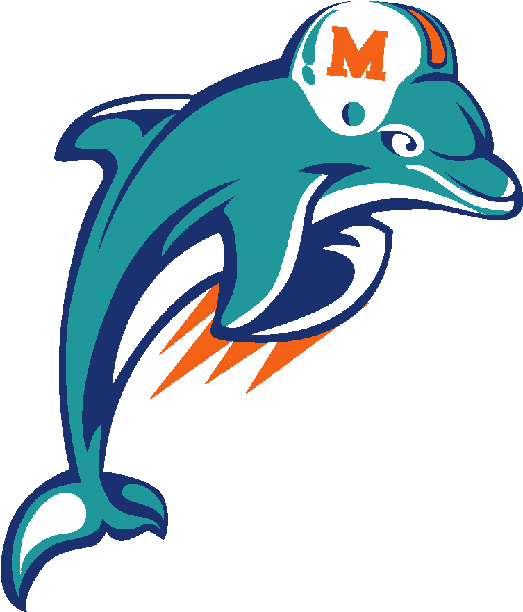

# Hey, I'm A.J. 👋
I am a Data Science student at the College of Charleston with a focus on AI engineering. I enjoy turning messy data into meaningful insights using Python, SQL, and tools like pandas and XGBoost. 
## Favorite Hobbies & Interests :brain: : 
- Football 
- One Piece 
- RPGs  
- Super Smash Bros 
- Horror movies  

Welcome to my world!
<!--
**ajboone/ajboone** is a ✨ _special_ ✨ repository because its `README.md` (this file) appears on your GitHub profile.

Here are some ideas to get you started:

- 🔭 I’m currently working on ...
- 🌱 I’m currently learning ...
- 👯 I’m looking to collaborate on ...
- 🤔 I’m looking for help with ...
- 💬 Ask me about ...
- 📫 How to reach me: ...
- 😄 Pronouns: ...
- ⚡ Fun fact: ...
-->
